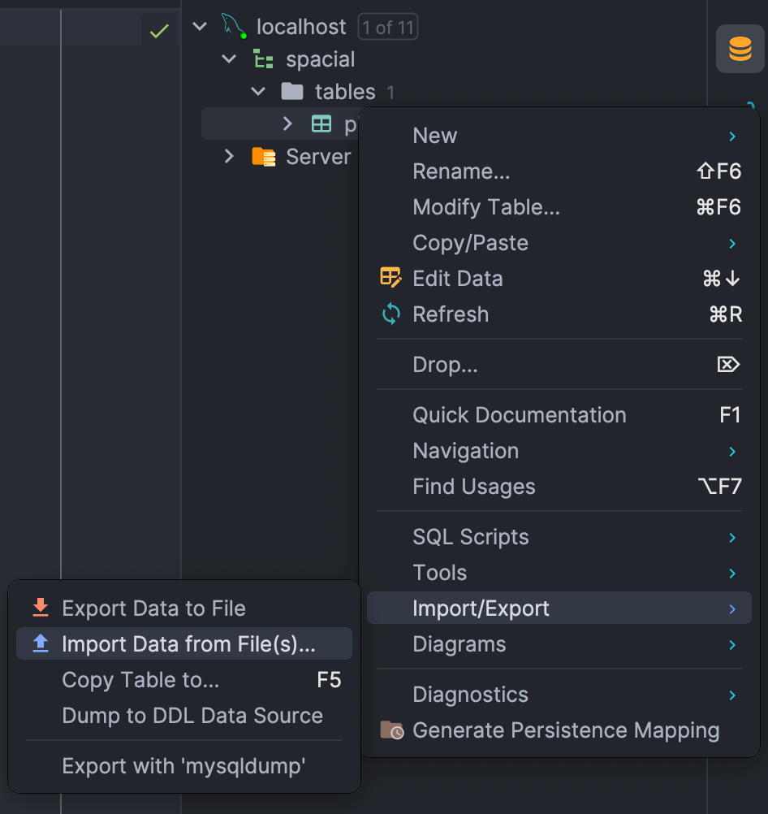

# 공간 인덱스 적용기

## 문제 상황

우주라이크 앱을 개발하면서 다음과 같은 요구사항이 있었다.
> 사용자가 검색어를 입력하면, 검색어가 포함된 가게를 사용자의 위치를 기준으로 가까운 순서대로 출력

처음 시도에서는 다음과 같은 쿼리를 사용했다.

```sql
SELECT place_id                                                 as placeId,
       name,
       code,
       address,
       road_address                                             as roadAddress,
       latitude,
       longitude,
       (6371 * acos(cos(radians(:latitude)) * cos(radians(:longitude))
           + sin(radians(:latitude)) * sin(radians(latitude)))) as distance
FROM place
WHERE name like :name
ORDER BY distance
```

위도와 경도를 이용해서 거리를 계산하는 하버사인 공식(Haversine Formula)를 이용한 방식을 통해 쿼리를 구성했다.
그 결과 원하는 결과를 찾을 수 있었으나, 쿼리 한번에 10초 이상 걸리는 문제가 발생했다. MySQL의 `ST_DISTANCE_SPHERE` 함수를 이용해봐도 크게 달라지지 않았다.

자료를 찾아본 결과, 조회 성능이 떨어지는 이유는 **쿼리가 인덱스를 타지 않기 때문**이라는 것을 알게 되었다.
그리고 MySQL에는 공간 데이터를 인덱스에 저장해서 쿼리의 성능을 높이는 **공간 인덱스**를 지원한다는 것을 알게 되었다.

프로젝트를 진행하는 당시에는 다른 요구사항에 밀려 결국 앱에서 직접 카카오 로컬 API를 통해 장소를 검색하는 방법으로 구현되었다.
당시의 상황을 재연하여 공간 인덱스를 적용하지 않았을 때와 적용했을 때를 비교해서 어느 정도의 성능 차이가 있는지 확인하려고 한다.

## 테스트 진행

### 데이터 저장

우주라이크에서 접근했던 방식과 마찬가지로 [소상공인시장진흥공단_상가(상권)정보](https://www.data.go.kr/data/15083033/fileData.do)에서 장소 데이터가 담긴 csv 파일을
다운로드받고 MySQL에 해당 정보를 저장했다.
csv 파일을 MySQL에 저장하기 위해 intellij의 import csv 기능을 이용했다.


하지만 이 방법을 통해 AUTO_INCREMENT PK를 선언할 때 다른 Column의 데이터가 잘못 들어가는 문제가 있었고,
상호명, 지점명, 도로명주소, 경도, 위도 정보만 먼저 추가한 후 PK를 추가하는 방식을 이용했다.

```sql
ALTER TABLE place
    ADD place_id BIGINT PRIMARY KEY AUTO_INCREMENT FIRST;
```

### 테스트 환경 환경

데이터를 저장한 결과 총 2499482개의 장소 정보가 있었다. 테스트는 M1 맥북 프로 기본형으로 진행했다.

테스트에 사용될 변수는 다음과 같이 설정했다.

```sql
SET @latitude = 37.47268564757623;
SET @longitude = 127.15240622792602;
SET @user_position = point(@longitude, @latitude);
SET @name = '가마로강정';
```

### 조회 쿼리 실행

첫번째 방법은 우주라이크에서도 시도해봤던 ST_DISTANCE_SPHERE 함수를 이용하는 방법이다.

```sql
SELECT place_id,
       company_name,
       branch_name,
       address,
       latitude,
       longitude,
       ST_DISTANCE_SPHERE(@user_position, point(longitude, latitude)) as distance
FROM place
WHERE company_name like CONCAT(@name, '%')
ORDER BY distance
LIMIT 10;
```

| 시도 | 실행 시간(ms) |
|:--:|:---------:|
| 1  |    799    |
| 2  |    806    |
| 3  |    840    |
| 4  |    799    |
| 5  |    834    |
| 평균 |   815.6   |

위의 쿼리를 총 5번 실행해본 결과 **평균 815.6ms**가 측정되었다.

### 공간 인덱스 적용
공간 인덱스를 사용하기 위해서는 위도와 경도를 합한 Point 타입의 컬럼이 필요했다. 따라서 다음과 같은 쿼리를 통해서 Point 타입의 coordinate 컬럼을 만들었다.
```sql
ALTER TABLE place ADD COLUMN coordinate POINT;
UPDATE place set coordinate=Point(longitude, latitude);
ALTER TABLE place MODIFY coordinate POINT NOT NULL;
CREATE SPATIAL INDEX coordinate_index ON place(coordinate);
```

쿼리 실행 결과 공간 인덱스가 생성되었지만, 다음과 같은 오류가 함께 출력되었다.
> The spatial index on column 'coordinate' will not be used by the query optimizer since the column does not have an SRID
attribute. Consider adding an SRID attribute to the column.

오류 메세지를 읽어보면 SRID 속성이 없기 때문에 쿼리 최적화가 일어나지 않음으로 SRID를 컬럼에 추가하라는 내용이었다.
오류 메세지를 이용해서 검색한 결과 [Upgrading Spatial Indexes to MySQL 8.0](https://dev.mysql.com/blog-archive/upgrading-spatial-indexes-to-mysql-8-0/)이라는 자료에서 오류의 이유를 찾을 수 있었다.

SRID(Spatial Reference Identifier)는 공간 좌표계에 관한 정보를 나타내는 값이다. 
MySQL 5.7까지의 버전에서는 공간 인덱스를 단일 SRID로 제한하지 않았기 때문에 별도의 설정을 하지 않아도 SRID 기본 값으로 쿼리 최적화가 일어났지만, 
MySQL 8.0부터는 하나의 SRID를 설정하지 않는 경우 최적화가 일어나지 않고 인덱스를 무시한다는 내용이었다.
> SRID 4326은 위도와 경도를 이용한 좌표 시스템으로 두 지점 사이의 거리를 구하는 이번 요구사항에 가장 적합한 SRID이다.
하지만 과거 버전의 MySQL의 경우 SRID 0만 지원하므로 호환성을 고려해야 한다.

해당 메뉴얼대로 테이블을 다음과 같이 수정했고, 그 결과 인덱스를 coordinate 컬럼과 coordinate_index 인덱스가 생성되었다.
```sql
ALTER TABLE place ADD COLUMN coordinate POINT SRID 4326;
UPDATE place set coordinate=ST_PointFromText(CONCAT('POINT(', latitude, longitude, ')'), 4326);
ALTER TABLE place MODIFY coordinate POINT NOT NULL SRID 4326;
CREATE SPATIAL INDEX coordinate_index ON place(coordinate);
```


그 다음 위의 동일한 쿼리를 실행시켰다.

| 시도 | 실행 시간(ms) |
|:--:|:---------:|
| 1  |    908    |
| 2  |    864    |
| 3  |    886    |
| 4  |    872    |
| 5  |    860    |
| 평균 |    878    |

기존의 방법보다 더 느려진 것을 볼 수 있었다. Explain을 이용해서 쿼리 계획을 살펴본 결과 타입이 all로 인덱스를 사용하지 않는다는 것을 알아냈다.

쿼리를 다시 살펴보니, WHERE 문에서 company_name을 이용해 가게를 검색하는데 company_name이 인덱스를 이용하지 않는다는 것을 알 수 있었다.
따라서 name_like_index를 추가해주었다.
```sql
CREATE INDEX name_like_index ON place(company_name);
```

다시 쿼리 계획을 확인해본 결과 타입이 range로 바뀌면서 인덱스를 활용한다는 것을 확인할 수 있었다.

| 시도 | 실행 시간(ms) |
|:--:|:---------:|
| 1  |    47     |
| 2  |    48     |
| 3  |    52     |
| 4  |    53     |
| 5  |    45     |
| 평균 |    49     |

동일한 쿼리를 실행한 결과 평균 49ms로 약 17배 가량 성능이 향상되었다.

## 결론
공간 인덱스를 적용해본 결과 조회 성능이 **815.6ms에서 49ms로 약 17배 정도 향상되는 성과**가 있었다.

공간 인덱스를 적용하지 않고도 815.6ms는 우주라이크에서 경험한 10초에 비해 빨랐다. 
프로젝트에서는 API 호출부터 반환까지 걸린 시간을 측정한 결과라는 점을 감안하더라도 큰 차이가 난다.

이는 EC2 프리티어의 낮은 사양 때문이라고 생각된다. 
당시 프로젝트는 EC2 프리티어 사양에서 동작했고, Docker를 이용해 Spring, MySQL, Redis를 동시에 사용하고 있었다. 
이런 상황이 10초라는 극단적인 쿼리 결과를 발생한 것으로 보인다.

> 추가로 Hibernate 5 이후에는 공간 데이터를 지원하기 때문에 엔티티 내부에 Point 타입을 통해 매핑할 수 있으며, JPQL에서도 공간 함수를 이용할 수 있다고 한다.

## 참고
- [[MySQL] ST_DISTANCE_SPHERE 함수를 활용하여 거리/반경 구하기](https://jinooh.tistory.com/76)
- [공간 인덱스로 조회속도 32배 개선하기(요즘 카페 지도 기능 개발)](https://kong-dev.tistory.com/245)
- [Upgrading Spatial Indexes to MySQL 8.0](https://dev.mysql.com/blog-archive/upgrading-spatial-indexes-to-mysql-8-0/)
- [MySQL LIKE % 위치에 따른 인덱스 사용 여부](https://k3068.tistory.com/106)
